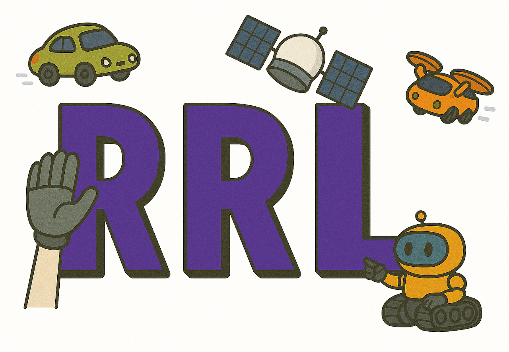

# Introduction 

This is the README for special topics class ROB-GY 7863 / CSCI-GA 3033 7863: Planning, Learning, and Control for Space Robotics. We will use this repository for simulations. 

<!-- 
")
 -->




# System Requirements 
- python 3.8+
- anaconda or miniconda 


# Getting started 
- create new conda environment 
```bash
conda create -n space-robotics python=3.8 -y
conda activate space-robotics
```
- install dependencies 
```bash
pip install -r requirements.txt
```
- run setup script 
```bash
python setup.py install
```

# Example
```bash
python lecture1/spacecraft_sim.py
```